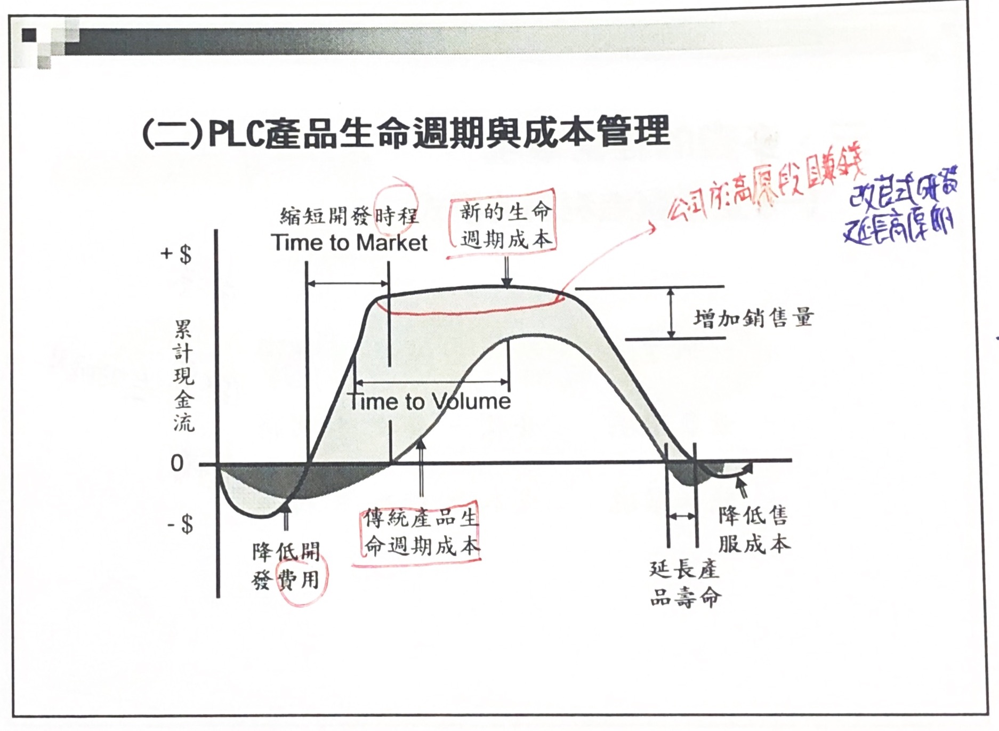

# 如何縮短開發週期與降低研發成本

- [降低研發成本](#降低研發成本)
- [如何縮短開發週期](#如何縮短開發週期)
## 降低研發成本

### 成本

#### 分類

- 管理
  - 變動成本(材料費,加工費)
  - 固定成本
- 類別區分
  - 材料費
  - 加工費
  - 管理費
- 策略區分
  - 策略成本
  - 非策略成本
- 性質區分
  - 有形成本
  - 無形成本
- 流程區分
  - 生產成本
  - 銷售成本
  - 管理成本
- 方法區分
  - ABC/ABM
  - 標準成本
  - 批次成本
  
#### 經濟用途分類

- 製造成本/生產成本/直接成本
  - 直接材**料**: 直接構成產品本身,出廠時的狀態,包材除外
  - 直接人**工**: 在現場操作機台,組立,包裝 等有摸到產品
  - 製造**費**用
    - 間接材料: 現場單位使用但不構成產品(價格較低)
    - 間接人工: QA/QC,保養,電工,倉儲,主管幹部
    - 其他製造費用: 各種能源,各種折舊(廠房,設備)
- 非製造成本/間接成本/管銷費用
  - 營業成本(業務,**銷**售): 業務,銷售等
  - **管**理成本: 行政,人事,總務,保安,採購,公關
  - **財**務成本: 財務(理財投資等)/會計(作帳)
  - 研**發**成本: 研發工資/獎金/行政

#### 毛利/淨利

- 毛利: 銷售收入-製造成本(料工費)
- 淨利: 毛利-非製造成本(銷管財發),通常指稅前

#### 原物料

- 原料: 直接材料 (Imply)
- 物料: 間接材料 (Supply)
- 材料: 原料+物料 (Material)

### 售價.成本公式

- 實際成本 + 必要利益 = 市場價格 (過去)
- 市場價格 - 目標成本 = 期待利益
- 市場價格 - 必要利益 = 必要成本 (現在)

> 現在價格由市場決定

### Product life cycle

TPM: 預防保養/預防維修(目的為減少客訴,eg: 通知客戶三個月換機油)

#### 關鍵點

- 上市時間(Time to marcket)
- 時間成本(Time to cost)

#### 著眼點

1. 縮短產品開發時程
2. 延長產品生命週期
3. 降低售後服務成本
4. 縮短初期流動管理期間
5. 提升產能與效率
6. 減少環保成本

### 經營模式

- 一般模式: 營收 - 成本 = 利潤 (供 = 需)
- 景氣模式: 營收 - 營收 = 利潤 (供 < 需 此時需要全力衝產能)
- 競爭環境: 成本 - 成本 = 利潤 (供 > 需 此時需注重成本)

#### 現場六件大事

- P 生產
- Q 品管
- C 成本
- D 交期
- S 安全
- M 士氣

#### 企業三大事

- Q 品管
- C 成本
- D 交期

### 企業策略與成本管理

### 研發

#### 零件減量

- 材料費 (只有這個會反映在財報上)
- 直接工時
- 資產效率 提升設備週轉率
- 設備能源
- 空間成本
- 外包費
- 品質成本
- 管理成本
- 設計成本 設計變更減少

#### 品質成本

- 內部失敗成本: 40%
- 外部失敗成本: 40%
- 預防成本(教育訓練,改良): 5%, 最少成本,提升最多 
- 鑑定成本(檢驗成本): 15%

#### 創造產品競爭力

1. 機能設計: 提高價值
2. 新樣式設計: 提高價值,降低成本
3. 成本設計: 降低成本

### 競爭策略

- 戰略修訂型: 降低材料費,考慮製品是否繼續生產
- 改善行策略: 降低加工費,外包費,管理費

### 研發成本之管理

> 只抄一家叫瓢竊, 全面抄襲叫創新 (by賈伯斯) . 
> Integration

|   | 成本管理  | cost down  |
|:-:|:-:|:-:|
| 活動範圍   | 全面性  |局部性   |
|  追求目標 | 利潤最大化  |目標達成   |
|  活動內涵 |系統   | 技巧  |
|  活動效益 |高   | 低(本身即是成本)  |
|  活動屬性 |戰略   |戰術   |
|  關注焦點 | 經營層  | 管理層與執行層  |
|   擴及效益| 持續改善  | 短暫效果  |

#### TCM全面成本管理體系

- ABC分類法
  - A: 關鍵少數 60%關注,品質為主
  - B: 中間 30%關注
  - C: 次要多數 10%關注,價格為主

#### 產品成本策略

#### 策略性研發成本管理

- [成本企劃步驟](https://www.cw.com.tw/article/5035361)(戴明)
  1. Plan 成本企劃
  2. Do 成本設計
  3. Check 確認
  4. Action 行動

#### 標竿定價與目標成本

> 標竿定價: 競爭產品, 銷售數量, 前代機型

- 標竿成本的步驟
  1. 計畫: 確定比較的流程與被比較的模範企業
  2. 分析: 確定與模範企業之差距,擬定未來之水準
  3. 整合: 內部交流與共識,制定部門目標
  4. 行動: 按計劃行動,跟蹤與比對
  5. 完成: 已成行業領導地位,重設標竿

> 成本企劃案例

### 成本設計活動

1. 設定成本目標
   1. 以機能特性計算法
   2. 成本率計算法
   3. 傳統產品比較法
   4. 單位成本累加法
2. 成本分配: 設定個別的成本目標
   1. 機能別分配
   2. 系統別分配
   3. 構造別分配
   
#### 開發階段成本設計

> 前期快,後期準

#### 開發課題

#### 成本設計實務

> 改善四原則

1. 刪除法
2. 合併法 (零件,流程合併)
3. 重組法 (重組順序等)
4. 簡化法 (自動化等)

#### 解決問題之創意法則

1. 取代
2. 結合
3. 調整
4. 擴大 (意見,速度,保證性,安全性,選擇性,功能性)
5. 修飾
6. 用途 (省略,跳過,分割)
7. 縮小
8. 重組
9. 評估 (可行性,效益性,前瞻性,弱點,補救性)

### 控制成本的層次與方法

- 成本管理
- Cost Data Bank (Cost Table)
- CQM (Cost Quality Management,品質管理師)
- 強化管理工具(VA/VE & [QFD](https://zh.wikipedia.org/wiki/%E5%93%81%E8%B3%AA%E6%A9%9F%E8%83%BD%E5%B1%95%E9%96%8B) etc.)
- VRP (Variety Reduction Program)

#### 成本管理層次

1. Cost Down
2. 成本評價
3. 變動管理
4. 成本設計
5. 成本企劃

#### 研發成本管理的關鍵成功因素

1. 以成本企劃來引導工程師的設計理念
2. 集合跨機能的系統力量來設計成本
3. 用創意來設計成本而非用口舌來Cost Down
4. 將成本管理建立成為一套執行系統
5. 將成本管理列為產品開發的審查項目
6. 實施產品損益管理

#### 田口方法

> 田口方法是要降低變異原因的影響,而不是去除變異的原因來改善品質

- 內部可控: S (找出最佳生產組合)
- 外部不可控: N (耐用度,雜音因子)

> 凡是不易控制或是必須花費高成本來控制的參數皆可視為雜音因子

1. 系統設計(創新): 選擇較佳的設計概念
2. 參數設計(最佳化): 最小化雜音對系統效果的影響
3. 允差設計(最適化): 確定最佳化設計參數之公差

## 如何縮短開發週期

### 專案工程

1. 小組成立
2. 列出專案工程項目
3. 工程項目排序
4. 併行工程
5. 找出關鍵及非關鍵工程 (時間越長越關鍵)
6. 主要資源優先給關鍵工程
7. 關鍵工程不可延遲, 非關鍵工程不可晚於關鍵工程
8. 非關鍵工程資三可優先支援關鍵工程
9. 獎勵關鍵工程

### 研發生產率利益模型

1. 研發能力利用率的提高
2. 項目資源效率的提高
3. 研發人員生產率
4. 合作/外包的增益
5. 研發行政管理效率的提高
6. 管道有效性
7. 產品戰略的改善及成功的加強(內外部資源有效利用)

### 資源管理的成熟度階段

0. 非正式資源管理
   
1. 短期利用管理
   1. 資源項目分配
   2. 資源工作組資源項目分配管理
   3. 利用報告/資源分配成本
  
2. 中期能力計畫與管理
   1. 資源能力計畫
      1. 短期資源能力計畫
      2. 中期資源能力計畫
      3. 與財務年度計畫的集成
      4. 管道能力管理
      5. 長期資源能力計畫
   2. 項目資源需求
      1. 結合資源需求的項目計畫
      2. 資源需求與技能類別
      3. 結合資源需求的資源工作管理
   3. 資源交易流程
      1. 資源需求
      2. 提出資源請求
      3. 資源分配
3. 資源需求計畫
   1. 項目資源需求計畫RPP
   2. 使用資源需求原則
   3. 初步資源估計
   4. 客訂步驟時間,以平衡資源
   5. 在技能間平衡資源需求
   6. 將資源需求轉化成資源需要
   7. 資源需求管理
   8. 工作量協調
4. 集成資源管理
   1. 第一層次集成點
      1. 與管道/組合管理的集成
      2. 與功能預算的協調
      3. 與年度財務的集成
      4. 與項目預算的集成
      5. 產品項目戰略集成
      6. 與人力資源系統類別的集成
      7. 與多個資源工作組的集成
      8. 與外部資源的集成
   2. 第二層次集成點
      1. 與項目計劃集成
      2. 閒環時間加總
      3. 與知識管理系統的集成
   3. 第三層次集成點
   
### 研發新思路,提高研發成功率

1. 使用[6SIGMA](https://zh.wikipedia.org/wiki/%E5%85%AD%E6%A8%99%E6%BA%96%E5%B7%AE)設計原理,提高設計成功率
2. 運用[TRIZ](#triz方法)方法實現創新設計
3. 利用[價值工程法](#價值工程法),提升研發產品的價值
4. [擴大決策資訊來源](#擴大決策資訊來源),使研發決策更客觀
5. 透過[流程管理](#流程管理),深化研發管理
6. 利用集成產品開發[IPD](#ipd),使研發效果更全面
7. 利用[項目管理法](#項目管理法),掌握研發製造進度

#### 6SIGMA步驟

1. 界定: 界定核心流程,關鍵顧客,CTQ(如下)
   1. 第一類對顧客越多越好
   2. 第二類屬必需品,沒有的話客戶滿意度會立刻下,但有的話滿意度不會增加
   3. 第三類與第二類相反, 缺少時對滿意度沒多大影響,但是有的話則有很大的幫助
2. 衡量: 利用統計學找出關鍵評量,為流程中的瑕疵建立衡量的基本動作
3. 分析: 探究誤差發生的基本原因
4. 改善: 找出最佳解決方案,然後擬訂行動計畫
5. 控制: 確保所做改善能持續下去

#### IDDOV六大流程的內容與工具

- Identify階段
  - 識別顧客需求,項目可行性研究
  - 工具: [QFD](https://zh.wikipedia.org/wiki/%E5%93%81%E8%B3%AA%E6%A9%9F%E8%83%BD%E5%B1%95%E9%96%8B),[新Q7](http://www.factory.org.tw/upload/news/Activity/2011/%AB~%BA%DE%B7s%A4C%A4%E2%AAk%C1%BF%B8q%C0%C9(%B0%AA%B6%AF%A5%AB%A4u%B7~_990526).pdf)等
- Define階段
  - 產品設計方案
  - 工具: QFD,新Q7,系統設計,[DFX](https://kknews.cc/zh-tw/news/abo4vpx.html),[FEMA](https://wiki.mbalib.com/zh-tw/FMEA%E7%AE%A1%E7%90%86%E6%A8%A1%E5%BC%8F)
- Develop階段
  - 式樣設計,製造保證
  - 工具: QFD,系統設計,DFX,FMEA,[DOE](https://wiki.mbalib.com/zh-tw/DOE),田口三大設計
- Optimize階段
  - 產品與過程優化
  - DOE,田口三大設計,FMEA,[SPC](https://wiki.mbalib.com/zh-tw/SPC),仿真,[ATP](https://wiki.mbalib.com/zh-tw/%E5%8F%AF%E6%89%BF%E8%AF%BA%E9%87%8F),優化試驗
- Verify階段
  - 設計方案驗證與DFSS績效報告
  - 仿真,V&V,可靠性,壽命及鑑定試驗,S/N比,AIP
  
#### TRIZ方法

- 技術系統的進化理論
  - S曲線
  - 技術成熟度預測方法
  - 技術進化模式(8種)
  - 技術進化路線
- 產品設計中的衝突及解決原理
  - 衝突的普遍性
  - 衝突的標準化(**39個標準工程參數**)
  - [發明原理](https://sites.google.com/site/sjutriz/home/triz/40ge-fa-ming-yuan-ze)(**40個發明原理**)
  - 衝突矩陣

#### 價值工程法

> V===F/C

- 功能分為基本功能與次級功能
- 次級功能具有可替代性或非必要
  - 次級功能越少,所花費成本就越少,產品及服務的價值就越高
- 非需要功能是根本不需要的功能
  - 剔除這些功能是VA/VE人員的責任

#### 提高價值的途徑

1. F➙ C↓ 功能不變,成本下降
2. F↑ C➙ 功能上升,成本不變
3. F↑ C↓ 功能上升,成本下降
4. F↑ C↑ 功能大幅上升,成本小幅上升
5. F↓ C↓ 功能小幅下降,成本大幅下降

#### VE步驟

1. 選定成員3~5
2. 產品零件拆解
3. 產品零件估計(單位成本估計)
4. 功能百分比估計
5. 成本百分比估計
6. 成本百分比與功能百分比對比,找出最不划算零件
7. 針對該2~3個零件提出V/E(價值工程)改善對策

#### 擴大決策資訊來源

- 網路
- 科研機構
- 展覽會
- 訂貨會
- 專業雜誌
- 市場調查
- 市場回饋

#### 流程管理

- 選擇適合的項目負責人
  - 資源配置,工作的組織都由他來安排和負責實施
- 獎金約佔工資的50%
- 建立統籌及監督的機制
  - 新品開發相關的部門定期參加新品開發鑑別會
  - 對整個專案進行調整及協調
  
#### IPD

> 核心思想為新產品的開發是一項投資決策

- 基於市場的開發
- 跨部門話系統的協同
- 同步開發模式(並行工程)
- 重用性(採用公用建構模組)
- 結構化流程
  - 產品開發要求在非結構化與過於結構化之間找到平衡
  
#### 項目管理法

1. 收集資料
2. 整理資訊
3. 專案計畫與修正
4. 專案之工作結構[WBS分析](https://wiki.mbalib.com/zh-tw/%E5%B7%A5%E4%BD%9C%E5%88%86%E8%A7%A3%E7%BB%93%E6%9E%84)
5. 專案日程表
   1. 甘特圖
   2. 活動網路之應用
   3. [PERT](https://zh.wikipedia.org/wiki/%E8%A8%88%E7%95%AB%E8%A9%95%E6%A0%B8%E8%A1%93)
   4. [CPM](https://zh.wikipedia.org/wiki/%E5%8D%83%E6%AC%A1%E5%8D%B0%E8%B1%A1%E8%B4%B9%E7%94%A8)
   5. [要徑排成法](https://www.3people.com.tw/%E7%9F%A5%E8%AD%98/%E8%A6%81%E5%BE%91%E6%B3%95/%E5%85%AC%E8%81%B7%E7%89%B9%E7%A8%AE%E8%80%83%E8%A9%A6-%E9%90%B5%E8%B7%AF%E7%89%B9%E8%80%83-%E9%81%8B%E8%BC%B8%E7%87%9F%E6%A5%AD-%E9%81%8B%E8%BC%B8%E7%87%9F%E6%A5%AD/2346411a-9b80-47d0-ba4b-5b9f64a6795a)
   6. 寬容時間
   7. 里程碑計畫的實現
   8. 壓縮工期的策略方法
6. 專案之執行
   1. 人力資源管理
   2. 協調溝通管理,專案經理75%~90%時間用於溝通
   3. 採購管理
   4. 品質管理
7. 專案之追蹤與控制
   1. 風險管理
   2. 時間控制
   3. 財務控制
   4. 專案收尾

